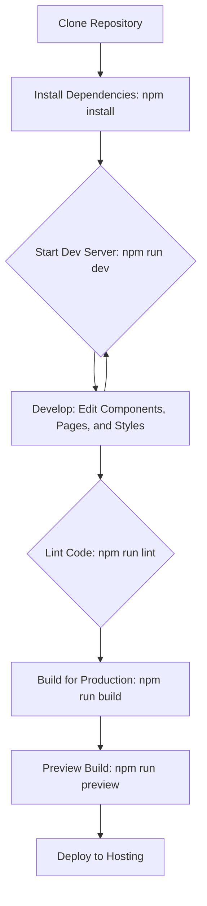

# K72 - Modern Animated React Website

<!-- Badges -->
<p>
  
  
  
  
  <!-- Add your own badges here: license, build status, etc. -->
</p>

> A foundational boilerplate for building fast, modern, and scalable web applications with React, Vite, Tailwind CSS, and GSAP for animations.

This project serves as a robust starting point for developing interactive and animated web experiences. It combines a fast development environment with powerful libraries for UI, styling, routing, and animations.

---

<!-- Placeholder for a screenshot or GIF of the project -->
<!-- !Project Screenshot -->

**Live Demo**: https://k72-delta.vercel.app/

## ✨ Features

*   **🚀 Blazing Fast Development**: Leverages **Vite** for a next-generation frontend tooling experience, offering near-instant server startup and Hot Module Replacement (HMR).
*   **⚛️ Modern React 19**: Built with the latest version of React, allowing you to use modern features like Hooks and functional components.
*   **💅 Utility-First Styling**: Comes integrated with **Tailwind CSS v4** for a highly efficient and customizable styling workflow.
*   **🗺️ Client-Side Routing**: Uses **React Router DOM** for seamless single-page application (SPA) navigation.
*   **🎬 Rich Animations**: Integrated with **GSAP (GreenSock Animation Platform)** for high-performance, professional-grade animations and page transitions.
*   **🧹 Clean Code**: Includes a pre-configured **ESLint** setup to enforce code quality and consistency.
*   **📦 Optimized for Production**: The build process is finely tuned to produce highly optimized, small, and efficient static assets.

## 🛠️ Tech Stack

*   **Framework**: React
*   **Build Tool**: Vite
*   **Routing**: React Router DOM
*   **Styling**: Tailwind CSS
*   **Animations**: GSAP
*   **Linting**: ESLint

## 🌊 Development Workflow

The diagram below illustrates the typical development workflow for this project.



## 📁 Project Structure

Here is an overview of the project's file structure and the purpose of each key file.

```
k72/
├── .eslintrc.cjs        # ESLint configuration for code quality and style.
├── index.html           # The main HTML entry point for the app.
├── package.json         # Project metadata, dependencies, and scripts.
├── tailwind.config.js   # Configuration for customizing Tailwind CSS.
├── vite.config.js       # Vite configuration file.
│
├── public/              # Static assets served directly without processing.
│   └── vite.svg
│
└── src/                 # Application source code.
    ├── Pages/           # Page components for different routes (Home, Agence, etc.).
    ├── assets/          # Static assets imported into components (images, fonts).
    ├── components/      # Reusable components.
    │   └── common/
    │       └── Stair.jsx  # Component for page transition animations.
    ├── App.jsx          # Root component where routing is defined.
    ├── index.css        # Global styles and Tailwind directives.
    └── main.jsx         # Application entry point.
```

### Key File Explanations

*   **`vite.config.js`**: Configures Vite and its plugins. In this project, it loads `@vitejs/plugin-react` for React support and `@tailwindcss/vite` for Tailwind CSS integration.
*   **`src/main.jsx`**: The entry point of the application. It renders the React app into the DOM and wraps the entire application in `BrowserRouter` to enable routing and the `Stair` component for page transitions.
*   **`src/App.jsx`**: The main application component. It uses `react-router-dom`'s `<Routes>` and `<Route>` components to define the application's pages and map them to specific URL paths.
*   **`src/components/common/Stair.jsx`**: This is a higher-order component that wraps the main `App`. It uses the `useLocation` hook from React Router and GSAP's `useGSAP` hook to create a "staircase" animation every time the route changes, providing a smooth transition between pages.

## � Getting Started

Follow these instructions to get the project running on your local machine.

### Prerequisites

*   **Node.js**: Version `18.x` or newer is recommended.
*   **Package Manager**: `npm`, `yarn`, or `pnpm`.

### Installation

1.  Clone the repository to your local machine:
    ```sh
    git clone https://github.com/peeyushtyagi09/K72.git
    cd K72
    ```

2.  Install the dependencies:
    ```sh
    npm install
    ```
    This command installs all the necessary project dependencies listed in `package.json`.

### Available Scripts

In the project directory, you can run the following commands:

*   **`npm run dev`**: Runs the app in development mode with hot-reloading. Open http://localhost:5173 to view it.
*   **`npm run build`**: Builds the app for production to the `dist` folder. It bundles and optimizes your code for the best performance.
*   **`npm run lint`**: Runs ESLint to analyze your code for potential errors and style issues.
*   **`npm run preview`**: Serves the production build from the `dist` folder locally. This is a great way to check the final build before deployment.

## 🚀 Deployment

This Vite project builds to a standard static site that can be deployed to any static hosting service.

1.  Run the build command:
    ```sh
    npm run build
    ```
2.  The output will be in the `dist/` directory.
3.  Deploy the contents of the `dist/` directory to a service like Vercel, Netlify, or GitHub Pages.

## 🤝 Contributing

Contributions are welcome! If you have suggestions for improvements, please open an issue or submit a pull request.

1.  Fork the Project.
2.  Create your Feature Branch (`git checkout -b feature/AmazingFeature`).
3.  Commit your Changes (`git commit -m 'Add some AmazingFeature'`).
4.  Push to the Branch (`git push origin feature/AmazingFeature`).
5.  Open a Pull Request.

## 📄 License

This project is licensed under the MIT License. See the `LICENSE` file for details.

---

*This README was enhanced with the help of Gemini Code Assist.*
